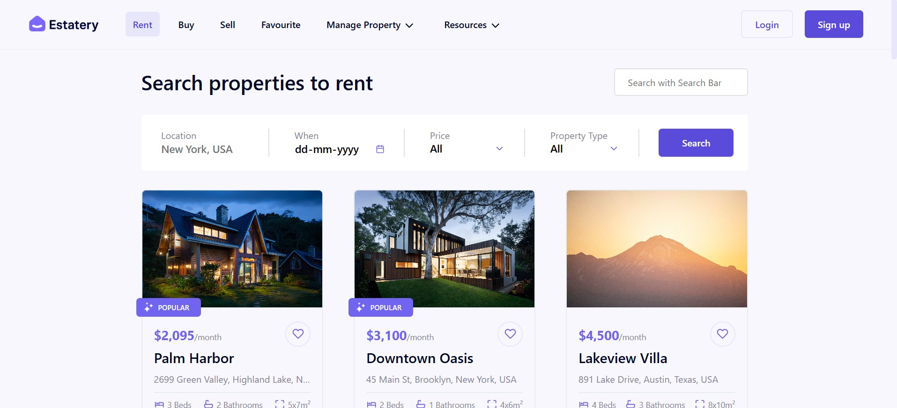
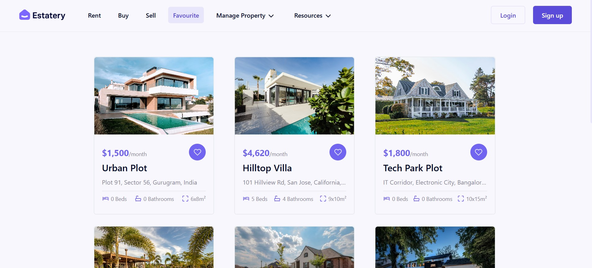

# 🏠 Rent a Property

A **Single Page Application** built with **React** to list rental properties with a robust filtering system and a Favorites feature.

---

## ✨ Functionalities Implemented

### 🏡 Home Page – Property Listings
- Shows list of available properties
- Four-level filters:
  - 📍 **Location**
  - 🏷️ **Property Type**
  - 📅 **Availability Date**
  - 💰 **Price Range**
- Responsive design with card layout
- Displays key property details (image, title, location, price, etc.)
- Add to **Favorites** button on each property

### ❤️ Favorites Page
- Displays only the properties marked as Favorite
- Provides option to remove from favorites
- Styled consistently with main theme

---

## 🖼️ UI Snapshots

### 🔹 Main Property Listings Page

### ❤️ Favorites Page

---

## 🧰 Tech Stack

| Technology        | Role                                      |
|-------------------|--------------------------------------------|
| **React**         | Frontend Framework                         |
| **React Router**  | SPA Navigation                             |
| **JavaScript (ES6+)** | Application logic                     |
| **Local Storage** | Persisting Favorite Properties             |

---

## 📦 Extra Packages Used

| Package             | Purpose                                  |
|---------------------|------------------------------------------|
| `react-router-dom`  | Routing between pages                     |

---

## 📚 Learnings from the Project

- ⚛️ React component architecture and props/state flow
- 🔄 How to manage state between components (Favorites logic)
- 🧩 Using dynamic filters efficiently
- 🧼 Code modularization and clean folder structure
- 🌐 Implementing SPA with `react-router-dom`

---

## 🔧 Future Improvements

- 🗂️ Paginate or lazy-load large property datasets
- 💾 Backend integration with APIs or Firebase for real data
- ✅ Input validation for filters
- 🌙 Add Dark Mode toggle
- 🔎 Add property detail page with full info and image gallery

---